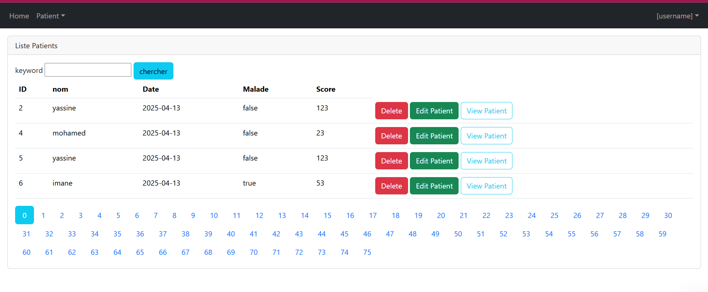
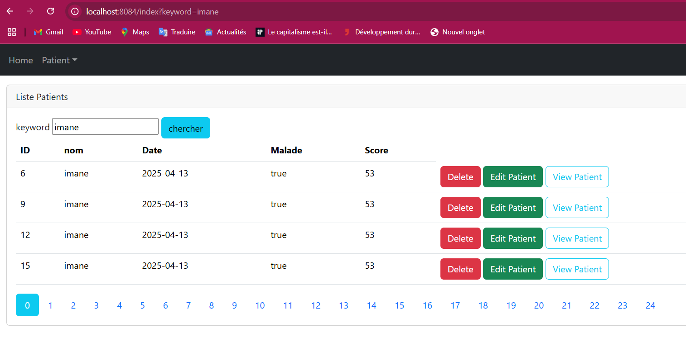
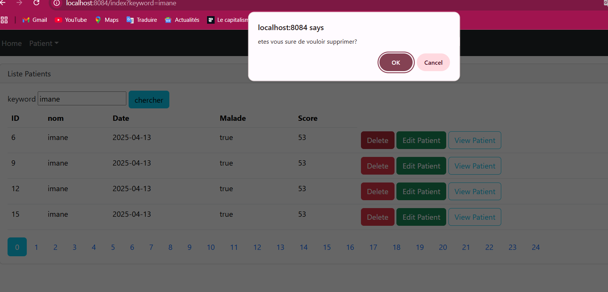
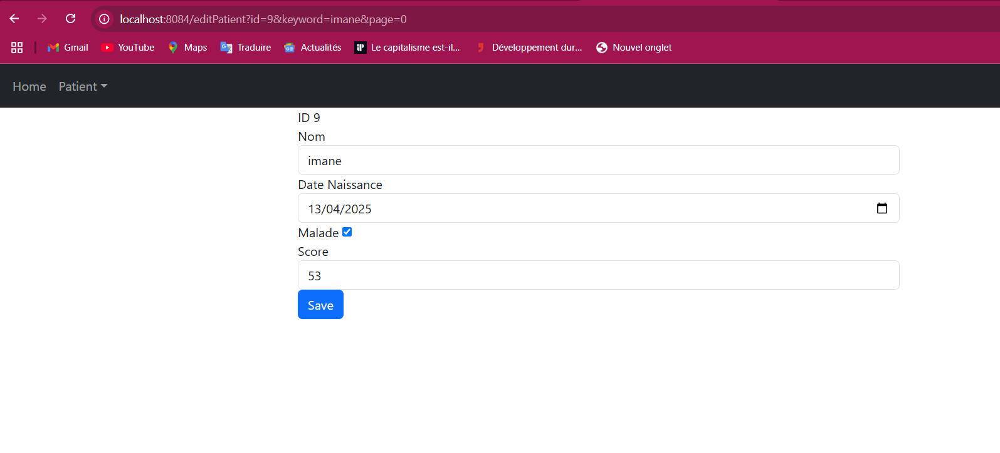
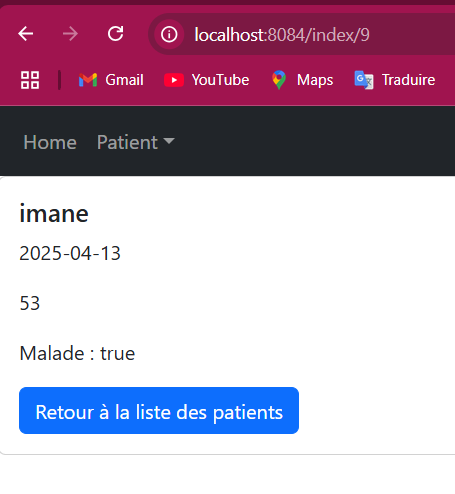
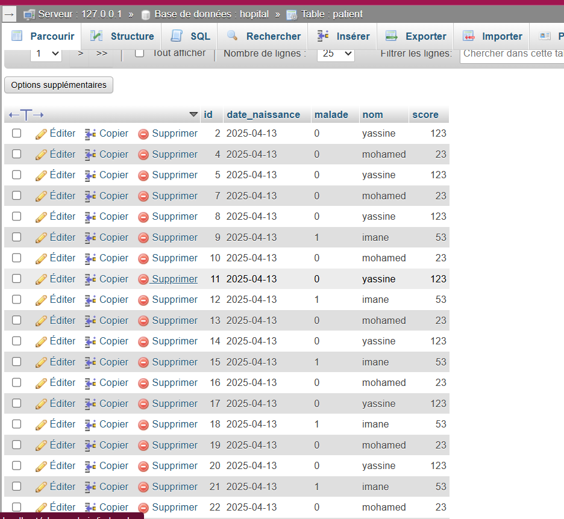

<h1>Activité Pratique N°3 - Spring MVC avec Thymeleaf</h1>

en utilisant un modele cote serveur et un moteur thymeleaf aussi un controlleur mvcet un modelqui envoit les données au view

<h3>En premier voir es interfaces</h3>

<h3>Rechercher imane</h3>

<h3>delete imane</h3>

<h3>Pour editer Patient</h3>

<h3>Pour view patient</h3>

<h3>voici la base données mysql</h3>

